# Agent Orchestrator architecture

Agent Orchestrator is a long-running Go daemon that supervises multiple
parallel AI coding-agent sessions. Project sessions own isolated Git
worktrees. Projectless standalone workers own AO-managed plain-directory
workspaces. Every session uses one interface mode at a time.

A TUI session runs its agent inside a native PTY/ConPTY runtime, with tmux as a
legacy or fallback runtime. A Chat session runs a native protocol controller
without an agent terminal runtime. Codex and all ACP Chat processes run in
detached per-session hosts, so replacing the daemon or desktop app does not
stop an in-flight turn. The ACP host also preserves connection setup, JSON-RPC
correlation, pending interactions, and acknowledged prompt replay while the
replacement daemon rebuilds its typed controller.

A durable handoff can move a compatible native conversation between TUI and
Chat, but both controllers are never live at once. The daemon coordinates both
modes through the same session, lifecycle, workspace, storage, and observation
boundaries.

## Table of contents

- [Mental model](#mental-model)
- [System overview](#system-overview)
- [Core architectural principles](#core-architectural-principles)
- [Component architecture](#component-architecture)
- [Data flows](#data-flows)
- [Persistence and CDC](#persistence-and-cdc)
- [Status derivation](#status-derivation)
- [Lifecycle management](#lifecycle-management)
- [Observation loops](#observation-loops)
- [HTTP layer](#http-layer)
- [Terminal multiplexing](#terminal-multiplexing)
- [Browser runtime bridge](#browser-runtime-bridge)

---

## Mental model

The fundamental architecture follows a simple three-stage pipeline:

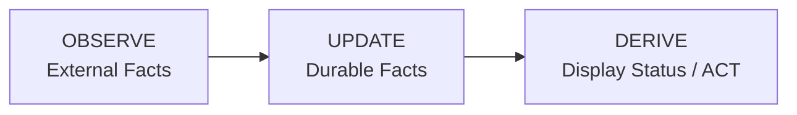

**Key insight:** Display status is never stored. It is computed at read time from durable facts.

### Durable session facts

The only persistent session state is:

- Claude and Codex TUI hook facts: the current parent turn and native subagent IDs are retained per runtime launch so activity stays active while a background subagent works. Codex also retains a successful spawn tool call until its delayed child-start hook supplies the native ID.
- `activity_state`: What the agent last reported (`active`, `idle`,
  `waiting_input`, `blocked`, `exited`). `waiting_input` is an agent at an
  empty prompt awaiting its next instruction. `blocked` is an agent stopped on
  a pending permission or approval decision. Automation must never inject input
  into a blocked session.
- `is_terminated`: Whether the session should be treated as over.
- `session_mode` plus its runtime/provider handle and generation: The currently
  committed controller epoch.
- `session_interface_transitions`: Durable checkpoints for an in-progress or
  completed TUI↔Chat handoff.
- PR facts: `pr`, `pr_checks`, and `pr_comment` tables.

### What is not durable

Display status like `working`, `needs_input`, `ci_failed`, `mergeable` are **computed at read time** by the service layer from the durable facts above.

---

## System overview

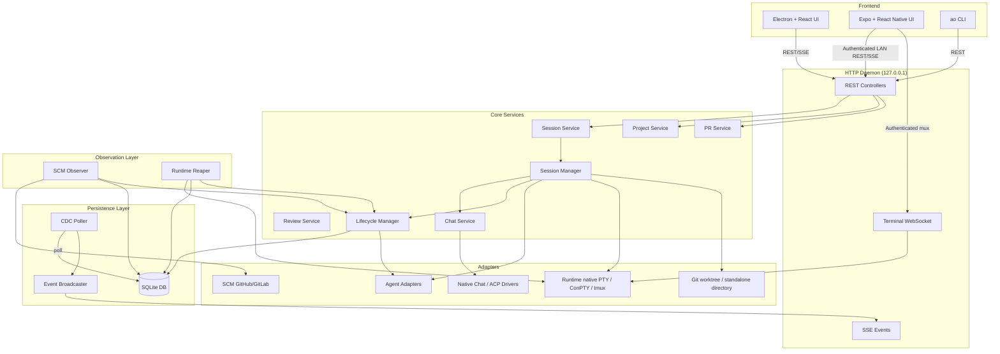

---

## Core architectural principles

### 1. Port-based design

Core code never depends on concrete implementations. All external systems are accessed through port interfaces defined in `backend/internal/ports/`:

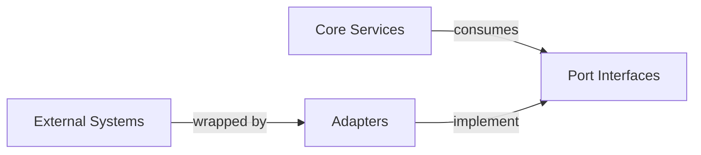

### 2. Durable facts, derived status

Storage layer persists minimal facts. Service layer computes display status on-demand:

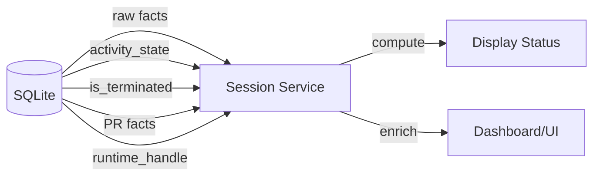

### 3. Observer pattern

Observation is separated from action:

- **Observe layer:** SCM Observer and Runtime Reaper poll external state.
- **Lifecycle layer:** Reduces observations into durable facts.
- **Service layer:** Computes display status from facts.

### 4. Change data capture

All durable changes flow through a CDC pipeline:

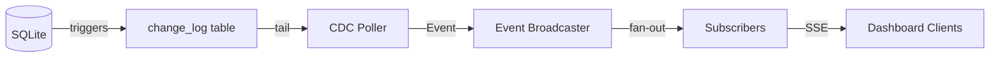

---

## Component architecture

### Package layout

```
backend/internal/
├── domain/              # Shared vocabulary and durable fact records
├── ports/               # Inbound/outbound interfaces
├── service/             # Controller-facing services
│   ├── project/         # Project CRUD
│   ├── session/         # Session read-model assembly
│   ├── chat/            # Chat controllers, persistent provider hosts + durable projection
│   ├── pr/              # PR observation service
│   └── review/          # Code review service
├── session_manager/     # Internal session command engine
├── lifecycle/           # Durable session fact reducer
├── observe/             # Observation loops
│   ├── scm/             # SCM (GitHub/GitLab) observer
│   └── reaper/          # Runtime liveness observer
├── storage/             # SQLite persistence
│   └── sqlite/          # DB, migrations, queries, stores
├── cdc/                 # Change-log poller and broadcaster
├── httpd/               # HTTP API, controllers, terminal mux
├── terminal/            # Terminal session protocol
├── adapters/            # Concrete adapter implementations
│   ├── agent/           # 23+ agent harnesses
│   ├── chatdriver/      # Native provider protocols and reusable ACP transport
│   ├── runtime/         # native PTY/ConPTY (legacy/fallback tmux) runtimes
│   ├── workspace/       # git worktree and standalone-directory adapters
│   ├── scm/             # GitHub/GitLab
│   └── tracker/         # GitHub/GitLab trackers
├── daemon/              # Production wiring
└── config/              # Environment-based configuration
```

### Core data flow

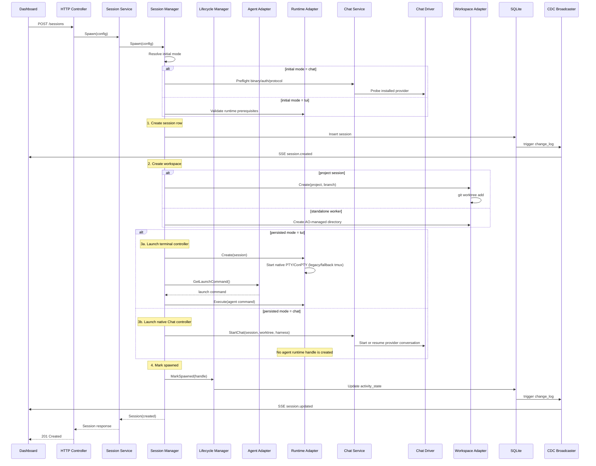

---

## Data flows

### Session spawn flow

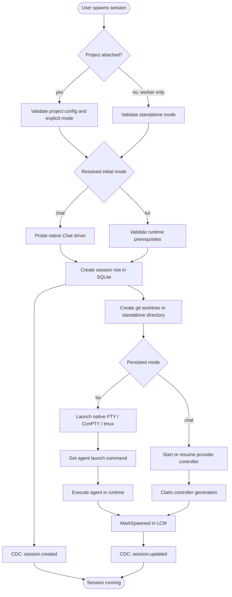

### Session interface handoff

An interface switch is a controller replacement inside the existing AO session,
not a new session. The session id, optional project, workspace, lifecycle facts,
and provider-native conversation id stay the same. For project sessions, branch
and PR ownership also stay the same. Only the mode-owned controller changes.

The generic coordinator lives in `session_manager`; providers opt in through the
small `AgentInterfaceHandoff` capability only after their TUI resume id and Chat
protocol id are proven to name the same native conversation. Claude Code and
Codex currently satisfy that contract. Merely having a Chat/ACP driver is not
enough to enable switching for another harness.

The native ID handed over is the current Terminal conversation, which can differ
from the last Chat provider (for example after replacing an orchestrator). This
does not prove that the new provider inherited the old context. Session Manager
reserves a `ChatProviderHandoff` only from a matching durable TUI→Chat transition;
ordinary resumes retain the exact-handle check. Chat resumes the verified target,
reconciles only its provider scope, and prepares a visible context boundary.
Lifecycle and SQLite atomically publish that boundary, native history, controller
generation, and any project-narrative ownership transfer, checking the observed
owner, head, sequence, and controller fence again after provider I/O. Prior rows
remain intact, but are not represented as context inherited by the new provider.
Ordinary Terminal restore retains its fresh-start fallback when native history is
unavailable, including rollback and crash recovery. Prior Chat rows remain intact;
returning with a new native identity publishes a separate context boundary rather
than claiming continuity. A Terminal→Chat handoff still requires native replay and
never silently substitutes a fresh Chat provider.

The native-history barrier combines trusted native checkpoints with the
latest completed AO turn in the active provider scope. A newer completed turn can
supersede a legacy hook fact tied to an older settled turn; otherwise a Chat answer followed by an
immediate round trip would keep waiting for the older Terminal answer to be last.
Hook timestamps must prove the fact predates the superseding turn; repeated text
alone is not evidence. A hook newer than the durable completion requires settled
replay after that high-water turn. Unknown hook facts still gate replay. Hook
observation time also orders native identities within a launch, so delayed hooks
cannot replace the current identity's facts.

Independent handoff publication settles the retired predecessor's work and fails
pending requests in the same transaction as history and ownership. Codex scopes
projection IDs at the adapter boundary and decodes them for native RPCs. A durable
branch flag preserves legacy unscoped Codex IDs on upgrade; native forks inherit
that flag, while new provider boundaries use scoped IDs.
When Codex proves fork ancestry, replay omits copied prefixes only if their stable
item IDs and complete content match retained ancestor rows. Those rows stay in
their original scope. Unknown ancestry or changed content is retained in full.

```mermaid
sequenceDiagram
    participant Client
    participant Manager as Session Manager
    participant Lifecycle as Lifecycle Manager
    participant DB as SQLite
    participant Source as Current Controller
    participant Target as Target Controller

    Client->>Manager: POST interface-transition(target, policy)
    Manager->>DB: Claim one active transition
    alt source = Chat
        Manager->>Source: Arm handoff; close intake and queue dispatch
    else source = TUI
        Manager->>Source: Gate new terminal input
    end
    Manager->>Target: Preflight binary/auth/protocol
    alt policy = drain
        Manager->>Source: Finish accepted work
    else policy = interrupt
        Source->>DB: Cancel queued Chat turns
        Manager->>Source: Cancel active provider turn
    end
    Manager->>Source: Stop and wait for shutdown
    Manager->>Lifecycle: CommitControllerEpoch(source, target, native id)
    Lifecycle->>DB: CAS mode + clear old generation/handles + idle fact
    Manager->>Target: Native resume(same conversation id)
    Manager->>DB: Persist new handle/generation; complete transition
    DB-->>Client: session_updated CDC invalidation
```

The session row is the commit point. If target startup fails, the coordinator
CASes the row back and resumes the source. If the daemon dies mid-handoff, boot
reconciliation marks the interrupted transition for recovery and restores the
controller named by the last committed `session_mode`. Lifecycle/automation
messages received during the no-controller gap are held in a durable outbox and
delivered through whichever controller ultimately owns the session. Terminal
transition paths, transient delivery failures, and daemon restarts all retain
the message for retry; Chat retries carry a stable idempotency key. Old Chat
events are fenced by controller generation; old TUI hooks are fenced by runtime
launch id.

`drain` is loss-minimizing and may wait on an approval or user-input request;
`interrupt` synchronously closes source intake and queue dispatch at transition
acceptance. After target preflight succeeds, it settles queued Chat turns and
then sends the provider's active-turn cancellation, allows a short transcript
flush, and stops the source. The reversible first phase preserves queued work if
the target is unavailable; its dispatch fence prevents a completion callback
from promoting that work during preflight or provider cancellation. Files and
completed provider context survive.
There is no provider-neutral way to migrate a currently executing tool call or a
detached background process, and AO does not synthesize terminal screen output
into structured Chat history.

For TUI drains, AO gates new terminal input before checking quiescence. Agent
adapters that can interpret their rendered TUI report work state and composer
occupancy as separate ephemeral facts. The runtime side of that contract must
provide the current rendered viewport with ANSI cell styles: tmux uses styled
`capture-pane`, while macOS and Windows detached PTY hosts maintain a VT cell
model beside their historical replay ring. AO accepts only repeated observations
of an idle surface with an empty composer, held across the settle window; a
visible draft fails with the source untouched and requires the user to submit,
clear, or explicitly discard it. Adapter/runtime pairs without rendered-surface
support retain the causally newer idle-fact or legacy terminal-idle fallback. An
unverified idle state has a bounded proof window; active work or a user-paced
decision remains unbounded.

### Conversation authentication facts

The daemon projects provider credential rejections into `conversations.account_json`
with explicit `authenticationState` (`unknown`, `required`, or `authenticated`).
`reauthRequiredAt`/`reauthReason` describe an outstanding demand; the last failure
and archived provider events remain after recovery. Partial account/plan reports
never imply usable credentials. A changed auth mode establishes an account-change
barrier for turns already in flight; repeated reports of the same mode preserve it.

Recovery requires an authoritative completed provider turn with no error, in the
active provider branch and owning controller generation, started and completed
after the outstanding demand/account-change barrier. Root-thread correlation
excludes nested Codex child-thread completions. Imported or synthetic history,
process readiness, local CLI login, and uncorrelated recovery reports cannot clear
a demand. ACP and Codex use the same daemon reduction of their normalized turn
completions; their credential verification and process reconnection remain provider
specific.

Before claiming a replacement generation, and when reading a snapshot with a
persisted demand, SQLite reconciles legacy warnings against bounded durable turn
and archived completion evidence. Evidence selection and clearing share the writer
transaction with generation/account updates; uncertain or older-generation evidence
leaves the demand intact. This is a targeted lazy repair, with no blanket database
migration and no provider/session restart. The renderer may dismiss the current
failure notice for that mounted conversation. Account JSON changes invalidate Chat
through a DB-triggered `session_updated` event even without a timeline change;
dismissal changes no auth fact or
work authorization. A new failure identity shows a new notice.

### Observation flow

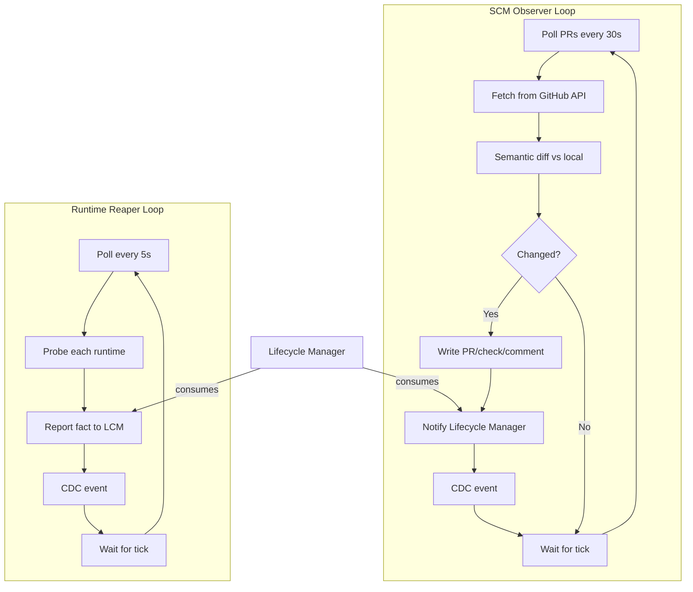

### Feedback routing flow

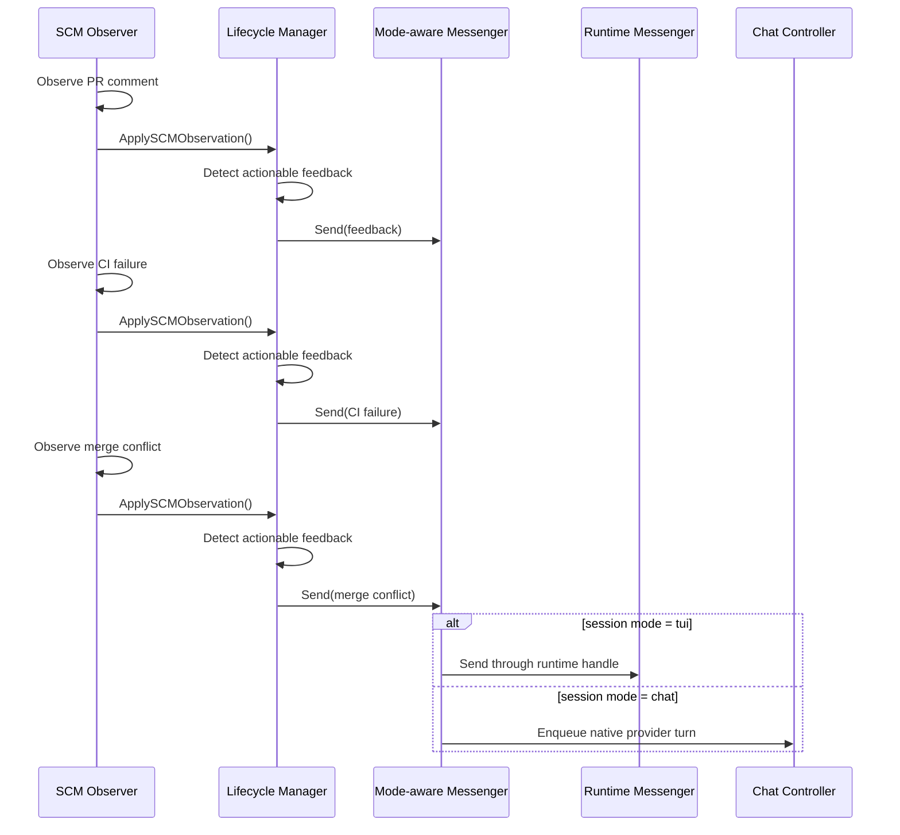

---

## Persistence and CDC

### SQLite schema

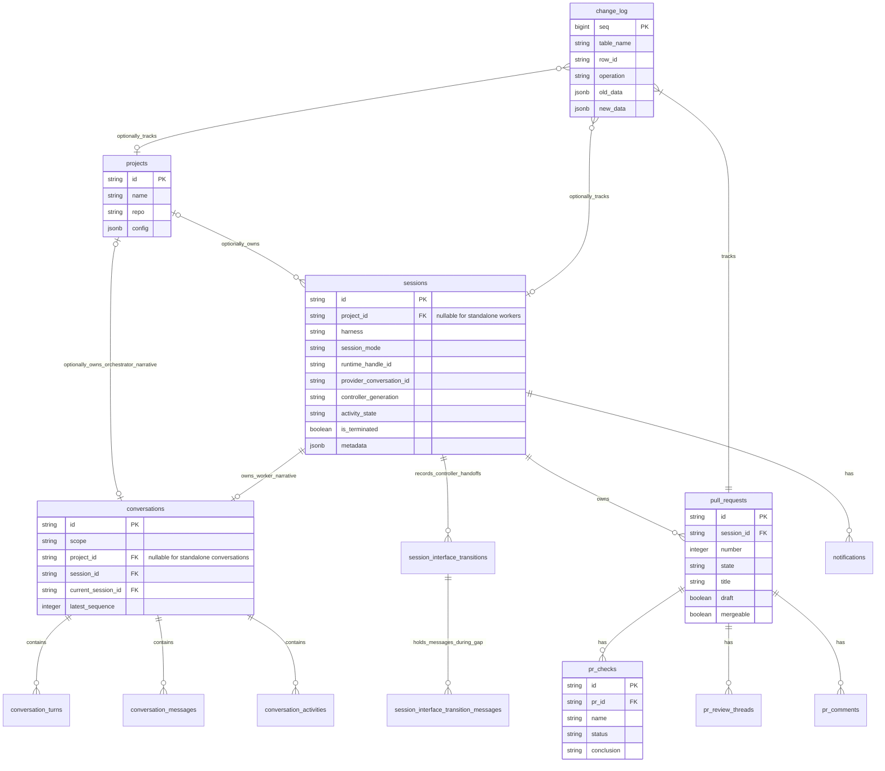

### CDC pipeline

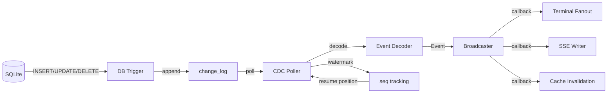

---

## Status derivation

### Display status precedence

The `service.Session` computes display status from durable facts using this precedence (highest to lowest):

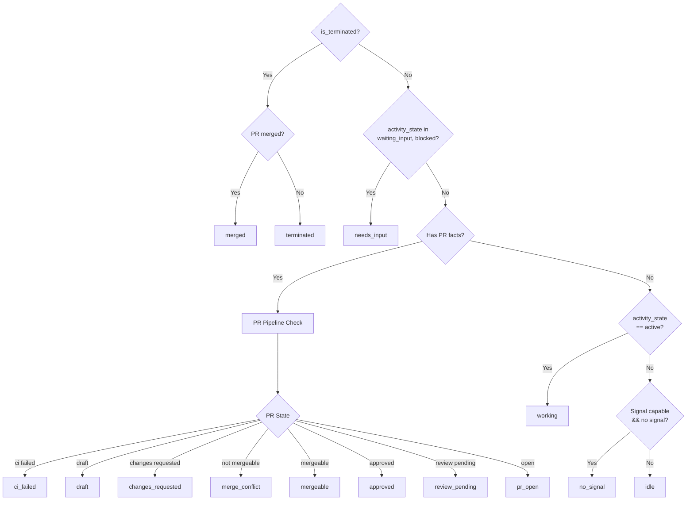

### PR pipeline states

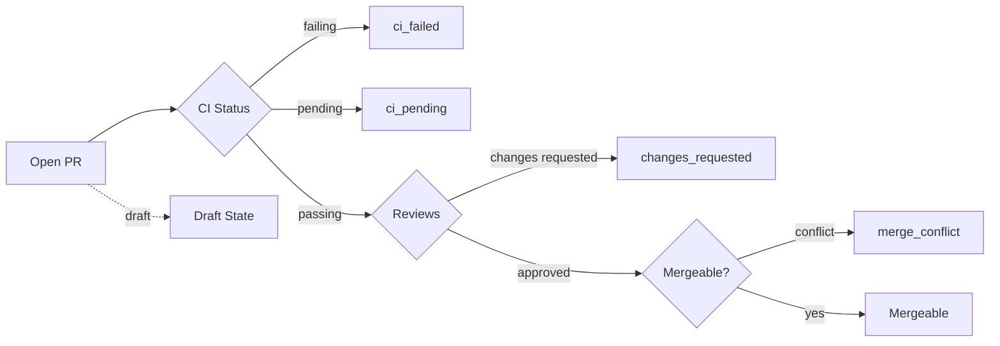

---

## Lifecycle management

### Lifecycle manager responsibilities

The `lifecycle.Manager` is the **canonical write path** for all session lifecycle facts:

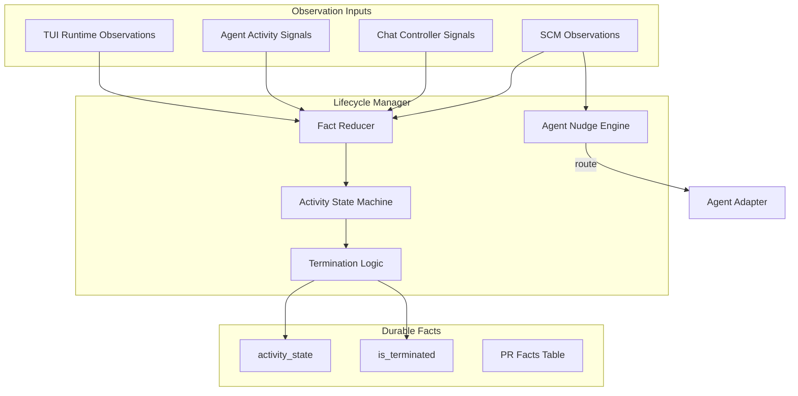

### Session state machine

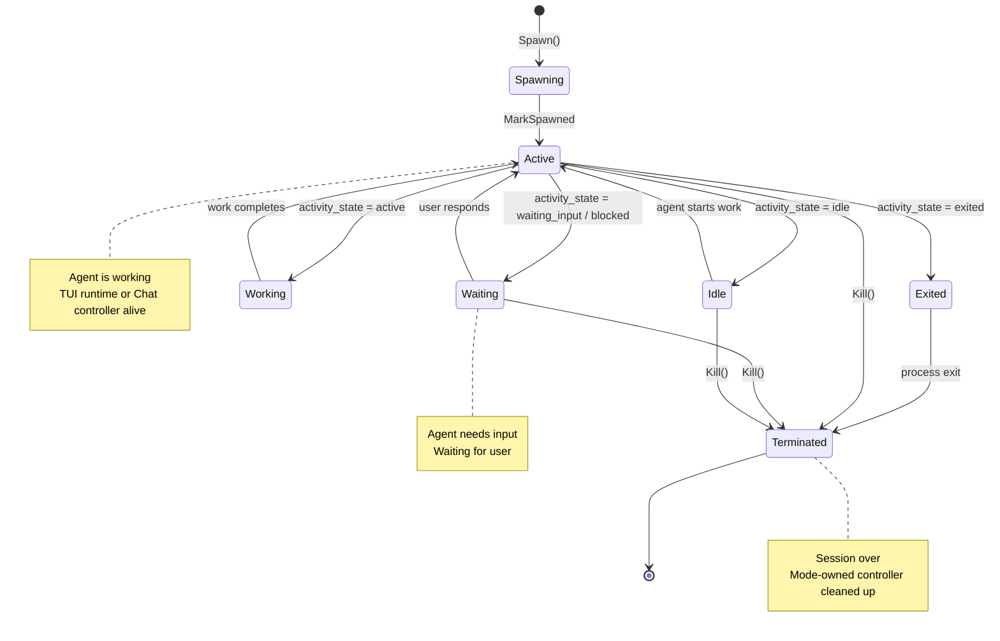

### Termination guardrails

The lifecycle manager only terminates when **all** conditions are met:

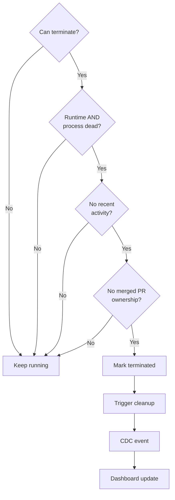

**Key principle:** Failed probes are NOT proof of death. A session is only terminated when the runtime and process are **both** clearly dead and recent activity doesn't contradict that.

---

## Observation loops

### SCM observer

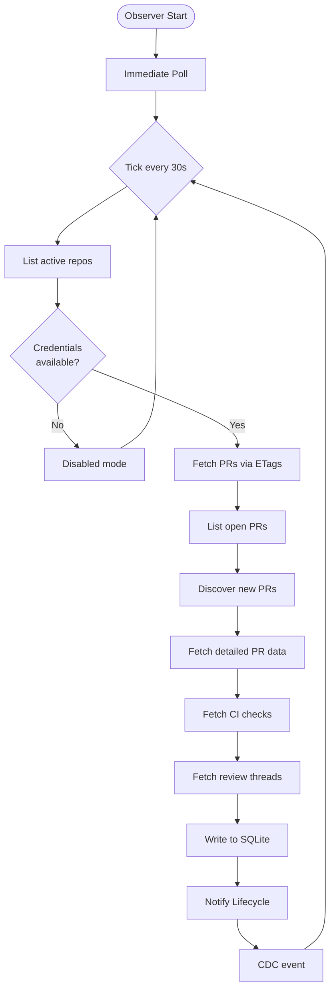

### Runtime reaper

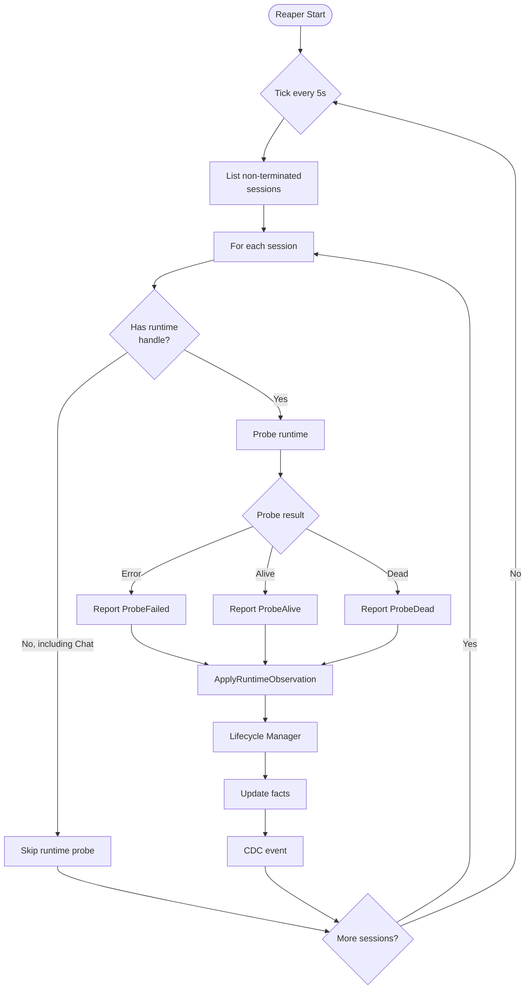

### Observation integration

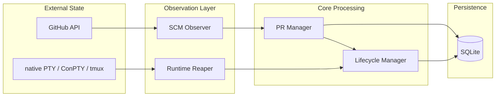

---

## HTTP layer

### API structure

```mermaid
flowchart TD
    subgraph HTTPD["HTTP Daemon"]
        Router[Router + Middleware]

        Router --> API[REST API]
        Router --> Events[SSE Events]
        Router --> Terminal[Terminal WebSocket]
    end

    subgraph Controllers["Controllers"]
        Sessions[Sessions Controller]
        Projects[Projects Controller]
        PRs[PRs Controller]
        Reviews[Reviews Controller]
    end

    subgraph Services["Services"]
        SessionSvc[Session Service]
        ProjectSvc[Project Service]
        PRSvc[PR Service]
        ReviewSvc[Review Service]
    end

    API --> Sessions
    API --> Projects
    API --> PRs
    API --> Reviews

    Sessions --> SessionSvc
    Projects --> ProjectSvc
    PRs --> PRSvc
    Reviews --> ReviewSvc

    Events -->|subscribe| CDC[CDC Broadcaster]
    Terminal --> TerminalMux[Terminal Manager]

```

### Multi-listener architecture (loopback + LAN)

The daemon runs two independent HTTP listeners sharing the same chi router:

1. **Primary (Loopback) Listener:** Binds `127.0.0.1:3001` with no
   authentication. All existing daemon operations, including the CLI and desktop
   app, use this listener.
2. **LAN Listener (Connect Mobile):** An opt-in second listener that binds
   `0.0.0.0:3011` (or an ephemeral fallback) **only when explicitly enabled**
   through desktop settings. Bearer-password middleware protects the app API.
   Loopback-gated shutdown, telemetry, mobile-control, and browser-control routes
   remain unavailable. Exactly `GET /api/v1/identity` is public for host and
   contract verification. Direct LAN transport is plaintext for trusted
   networks. A managed cloudflared HTTPS endpoint wraps the authenticated mobile
   path. The current v2 offer advertises Tailscale addresses as plaintext;
   Tailscale TLS setup and QR advertisement remain incomplete. The rotating password is persisted in a mode-`0600`
   file at `AO_DATA_DIR/mobile/config.json` (normally
   `~/.ao/data/mobile/config.json`); its comparison hash is in memory. See the
   [current access guide](../frontend/src/docs/content/configuration/remote-access.mdx)
   and [historical LAN ADR](adr/0001-lan-listener-for-mobile.md).

The mobile app is a second thin renderer over those same session resources. It
branches on the session's persisted `mode`: TUI attaches the existing mux PTY,
while Chat reads the paged conversation projection and uses the durable CDC SSE
stream only for targeted invalidation/reconnect. Sends, approvals, input,
provider configuration, compaction, rollback, and shell creation remain daemon
commands; no provider or lifecycle policy is implemented in React Native.

For implementation details and security model, consult `docs/adr/0001-lan-listener-for-mobile.md` and the glossary in `CONTEXT.md`.

### Request flow

```mermaid
sequenceDiagram
    participant Client
    participant Router
    participant Controller
    participant Service
    participant Manager
    participant Store
    participant DB

    Client->>Router: POST /api/v1/sessions
    Router->>Router: Middleware (auth, logging)
    Router->>Controller: handler(w, r)
    Controller->>Controller: decode JSON
    Controller->>Service: Spawn(config)
    Service->>Manager: Spawn(config)
    Manager->>Manager: Resolve mode and preflight its controller
    Manager->>Store: Create session
    Store->>DB: INSERT INTO sessions
    DB->>Store: session record
    Store->>Manager: session record
    Manager->>Manager: Create and provision workspace
    alt mode = tui
        Manager->>Manager: Launch terminal runtime/controller
    else mode = chat
        Manager->>Manager: Launch runtime-less Chat controller
    end
    Manager->>Service: Session response
    Service->>Controller: enriched session
    Controller->>Controller: encode JSON
    Controller->>Client: 201 Created + Session
```

---

## Terminal multiplexing

The mux is the primary agent controller only for TUI-mode sessions. Chat-mode
sessions have no agent runtime handle and never attach their provider through
tmux. They may still open session-scoped shell terminals as a worktree escape
hatch; those shells are separate resources and do not become the agent
controller.

### Terminal architecture

```mermaid
flowchart TD
    subgraph Frontend
        Browser[Browser Terminal]
    end

    subgraph HTTPD
        WS[WebSocket Handler]
    end

    subgraph Terminal
        Mux[Terminal Mux]
        Sessions[Session States]
    end

    subgraph Runtime
        TMux[tmux Runtime]
        MacPTY[macOS/Linux native PTY Host]
        ConPTY[conpty Runtime]
    end

    Browser -->|WebSocket| WS
    WS -->|attach| Mux
    Mux --> Sessions
    Sessions -->|legacy or startup fallback| TMux
    Sessions -->|create new macOS/Linux| MacPTY
    Sessions -->|create| ConPTY

    TMux -->|PTY attach| Mux
    MacPTY -->|loopback dial| Mux
    ConPTY -->|loopback dial| Mux

    Mux -->|frame| WS
    WS -->|binary| Browser

```

### Attach flow

```mermaid
sequenceDiagram
    participant Client as Browser
    participant WS as WebSocket Handler
    participant Mux as Terminal Mux
    participant Runtime as native PTY/ConPTY (legacy/fallback tmux)

    Client->>WS: WebSocket upgrade
    WS->>Mux: Attach(session, rows, cols)
    Mux->>Runtime: Attach(handle, rows, cols)

    Runtime->>Runtime: Connect to detached host or create tmux attach PTY

    loop Data Loop
        Runtime->>Mux: PTY output
        Mux->>WS: Binary frame
        WS->>Client: WebSocket message

        Client->>WS: User input
        WS->>Mux: Input frame
        Mux->>Runtime: Write to PTY
    end

    Client->>WS: Close
    WS->>Mux: Detach
    Mux->>Runtime: Close attachment stream
```

## Browser runtime bridge

Browser automation uses a dedicated local socket (`browser.sock` on Unix,
`ao-browser[-dev]` named pipe on Windows) between the daemon and Electron. The
daemon owns command authorization/correlation; Electron owns the actual browser
targets. Commands never use the supervisor liveness socket and never enable an
unauthenticated remote-debugging port.

Electron attaches its debugger directly to the selected session's
`WebContentsView`, so the protocol transport cannot enumerate or attach to the
AO renderer or a different session. The loopback `/api/v1/browser` surface is
blocked entirely on the opt-in LAN listener.

Temporary browser profiles isolate sessions by default. Named persistent profiles can be reused across sessions, sharing their cookies/storage deliberately. Browser import reads supported source profiles without modifying them and stores results under AO data.

Request observation is an explicit, temporary browser command rather than a
standing debugger feature. Capture is off by default, bound to the active tab
that starts it, limited to 200 in-memory metadata entries, and automatically
expires within at most five minutes. AO never requests or stores request or
response bodies; it allowlists safe headers and redacts URL credentials,
fragments, and query values. Closing the tab, ending the session, or shutting
down Electron disables and discards the capture.

---

## Load-Bearing Rules

These rules are **load-bearing**. Changing them breaks fundamental
architectural assumptions:

1. **Never store display status:** Status is derived from durable facts at read time.
2. **Never treat failed probes as death:** A failed probe is a fact, not a termination signal.
3. **Never force-delete dirty worktrees:** User data safety comes before cleanup convenience.
4. **Keep all app state under `~/.ao`:** Do not use OS-default app-data locations.
5. **Keep the primary daemon on loopback:** Only the opt-in authenticated mobile path provides off-device access. Control routes remain loopback-gated.
6. **Keep the CLI thin:** All logic lives in the daemon. The CLI is an HTTP client.
7. **Use CDC as the source of truth for events:** DB triggers write to `change_log`, and the poller fans out changes.
8. **Keep adapters as leaves:** Adapters never import core packages, only ports and domain.
9. **Keep hooks gitignored:** Every file an adapter writes must be in `.gitignore`.
10. **Never change migrations:** Add new migrations instead of modifying existing ones.

---

## Summary

Agent Orchestrator's architecture is designed around:

- **Separation of concerns:** Observation, persistence, and display are distinct layers.
- **Port-based design:** Core code depends on interfaces, not implementations.
- **Durable minimalism:** Store only facts, and compute everything else.
- **Event-driven updates:** CDC broadcasts changes to all subscribers.
- **Isolation:** Each project session owns a Git worktree, each standalone worker owns an AO-managed directory, and every session has exactly one live mode-specific controller, including across handoffs.
- **Safety:** Termination is conservative, paths are validated, and hooks are gitignored.

This architecture enables parallel AI agents to work safely while maintaining complete visibility and control.
